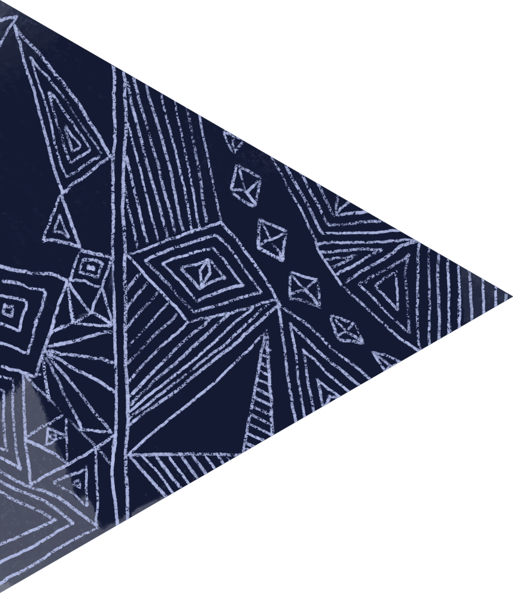
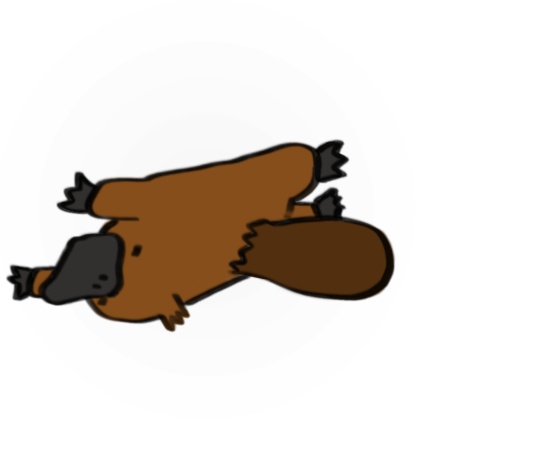
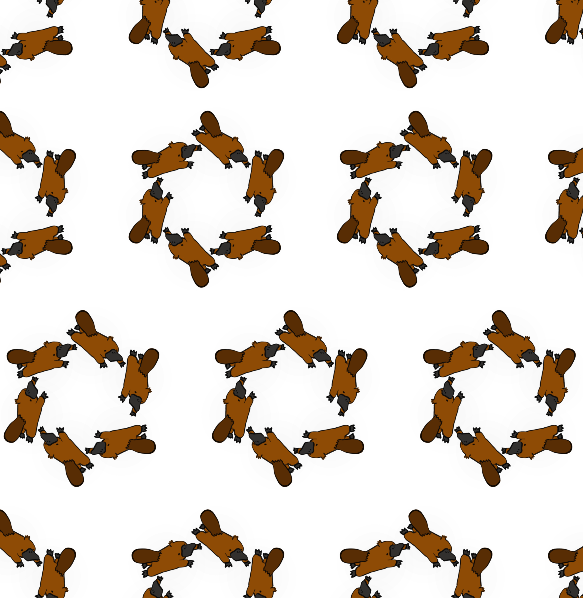
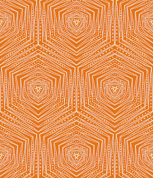
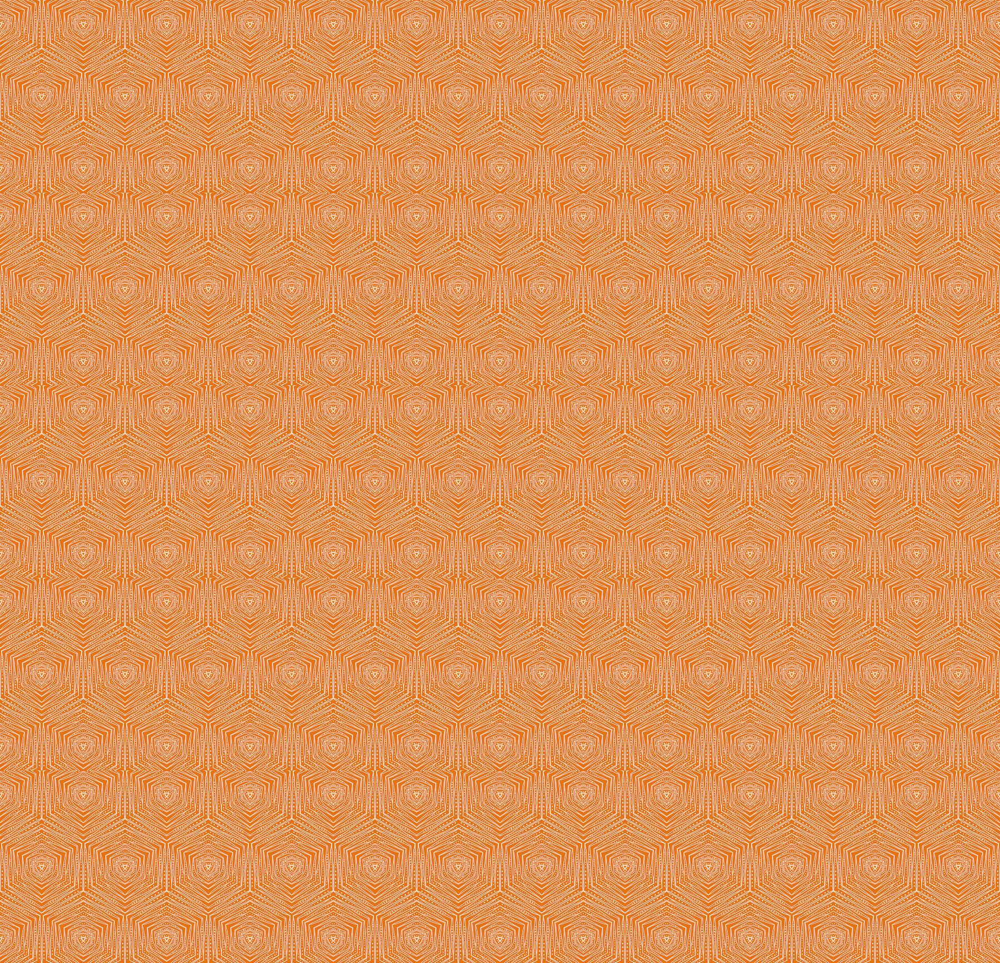

# Patternate

Generate tesselated patterns from hand-drawn images.

## Demo

It currently works with three patterns. 

### Hex
Uses an equilateral triangle to generate an image of tessalating hexagons.

Input image: <br />


Generated Pattern: <br />


### Hex Outer
Tiles a triangular shape around a hexagon.

Input image: <br />


Generated Pattern: <br />


### Rectangle
Tiles any rectangular image.

Input image: <br />


Generated Pattern: <br />


## Guide Mode
The guide mode generates a template which can be used as a layer mask when creating images.

## Usage

- clone the repo
- upload your input image to the /assets/images folder
- add your input image in place of the demo image, or drag and drop the image to the canvas
```
// HexCanvas.vue
    <div class="image-holder">
        
    </div>
```
- use the inputs on the menu to specify the height and width of your pattern, then click on the save icon

## Coming Soon

~~- improved interface~~<br/>
~~- add a background colour to patterns with transparency~~
~~- drag and drop image upload~~
- more pattern modes

## Contributions

Contributions welcome!
