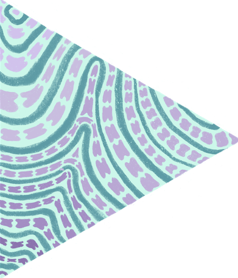
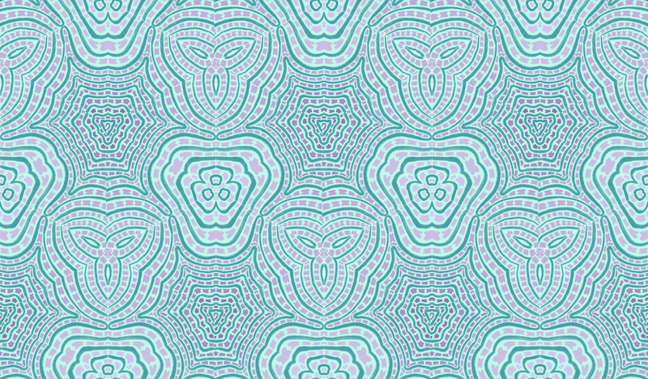

# Patternate

Generate tesselated patterns from hand-drawn images.

## Demo

It currently works with one pattern which uses an equilateral triangle to generate an image of tessalating hexagons

Input image: <br />


Generated Pattern: <br />


## Usage
- clone the repo
- add your input in place of the demo image is:
```
// DrawingCanvas.vue
    <div class="image-holder">
        
    </div>
```
- use the inputs on the menu to specify the height and width of your pattern, then click 'save canvas'

## Coming Soon

- improved interface
- more patterns

## Contributions

Contributions welcome!
